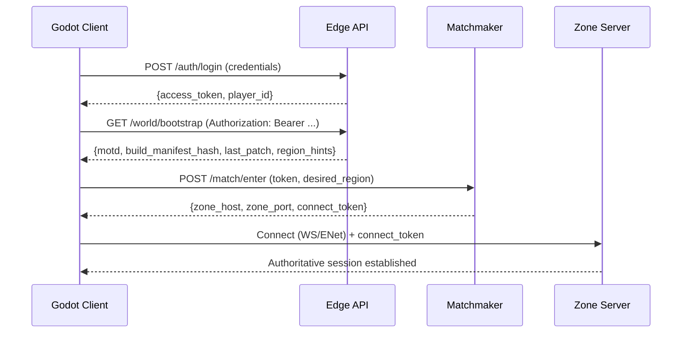
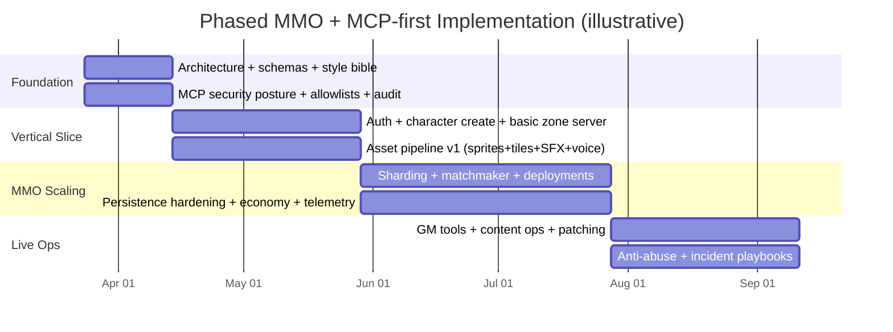

# Best MCP Server Stack for a Godot Pixel RPG Online MMO Using Only Claude, Cursor, and MCP

## Executive summary

Building a full-stack online MMO in **Godot** while using **only Claude + Cursor + MCP servers** is feasible—but you need to interpret the constraint correctly: **Claude/Cursor act as the “agentic control plane,” and MCP servers are the only bridges to external systems** (cloud resources, databases, deployment, observability, and non-text generation like image/audio). This aligns with how **Model Context Protocol (MCP)** is designed: a standardized client/server adapter layer so AI tools can safely access external tools and data sources. citeturn7search18turn17search17turn20view3

From the current ecosystem maturity (as of early 2026), the “best” MCP servers for an MMO are those that (a) are **official/managed**, (b) cover **infrastructure + data + security**, and (c) let you run **low-latency real-time services** and **large-scale content pipelines** without leaving Claude/Cursor. In practice, the strongest shortlist is:

- **Cloudflare MCP (managed remote)** for edge compute, stateful coordination primitives that are *actually suited to multiplayer patterns*, global routing/DDoS/WAF, and a surprisingly complete MCP surface (including a hosted endpoint). citeturn19view0turn11search2turn11search1turn20view3  
- **AWS MCP (official)** for production-grade MMO hosting (notably managed dedicated game servers), high-scale databases/caches, mature security/compliance, and container/Kubernetes orchestration. citeturn19view1turn12search0turn12search6turn16search8  
- **Google Cloud MCP (official + managed remote)** for strong data platforms and “remote MCP servers with governance/IAM,” plus first-party patterns to host/build MCP servers. citeturn20view3turn19view2turn14search0turn14search2  
- **Azure MCP Server (official)** for deep Azure operations from agents plus **PlayFab** (a purpose-built live game backend platform) and globally distributed data options. citeturn19view3turn20view0turn13search25turn13search1  
- **Supabase MCP (official community + strongly aligned product)** for developer-velocity: Postgres + auth + realtime channels/presence + object storage + pgvector—excellent for player data, CMS-like live ops tools, and internal pipelines. citeturn19view4turn15search0turn15search1turn15search3  

For “all generative content” (sprites/music/SFX/voice), Claude is the creative director and planner, but **you must route image/audio generation through MCP-accessible services**, because Claude’s core modalities are **text output** with **image input** (vision), not native image/audio output. citeturn10view3turn10view4turn10view1 The clean solution is: **Claude writes structured asset specs → calls MCP tools that invoke image/audio models → stores outputs in your asset store/CDN → Claude runs QA loops using vision and metadata**.

## What MCP means here and the operating model

MCP is an open protocol for tool/resource access by AI “hosts” (like code editors and assistants). It supports **local MCP servers (stdio)** and **remote MCP servers (HTTP)**. citeturn20view3turn7search18turn17search29

In this MMO context:

- **Claude + Cursor** are where you *think, plan, generate code/content specs, run reviews, and orchestrate workflows.*  
- **MCP servers** are the *only* way Claude/Cursor can touch:
  - cloud infrastructure (compute, DNS, CDN, DBs),
  - CI/CD,
  - secrets and config,
  - observability,
  - and non-text generation services (image/audio/model inference).

This division is important because it suggests a highly effective architecture:

- **Agent plane** (Claude/Cursor + MCP): provisioning, content generation factories, admin workflows, incident response.
- **Game plane** (actual runtime): authoritative game servers, realtime gateways, persistence, asset delivery.

Claude also supports direct use of MCP tools via the Claude API tool interfaces—MCP tool schemas are close to Claude’s tool format, and the docs describe how to convert/import MCP tools or use connectors. citeturn10view2turn17search29

## Prioritized top MCP servers with rationale and comparison tables

### Prioritized shortlist

#### Cloudflare MCP Server

Rationale: Cloudflare has one of the most “MCP-native” offerings: a **hosted MCP endpoint** for the Cloudflare API and strong first-party support for deploying remote MCP servers. citeturn19view0turn6search6turn6search8 It also uniquely offers multiplayer-friendly primitives: **Durable Objects** are explicitly positioned for “multiplayer games,” chat, collaboration—stateful coordination without you running servers. citeturn11search2turn11search18

#### AWS MCP Servers (awslabs)

Rationale: AWS offers official MCP servers and prescriptive guidance for secure deployments (OAuth, WAF, logging, orchestration). citeturn19view1turn20view4 For MMO hosting, AWS is the most directly game-server-centric at hyperscale via **Amazon GameLift Servers** (session-based multiplayer server hosting, managed fleets/containers, scaling). citeturn12search0turn12search4turn12search32

#### Google Cloud MCP (managed remote MCP servers)

Rationale: Google provides **managed remote MCP servers** with governance, IAM controls, and MCP authorization compliance. citeturn20view3turn19view2 For data, Cloud Run (serverless containers) and Spanner (global relational platform) are strong building blocks for MMO services and admin tools. citeturn14search0turn14search2

#### Azure MCP Server

Rationale: Azure has an official MCP server with **Entra ID auth** and Azure CLI integrations, designed for agentic operations from IDEs. citeturn19view3turn20view1 For games, **PlayFab** provides “complete backend platform for games” including live ops and analytics; it’s often valuable even if you self-host core realtime. citeturn13search25turn13search0

#### Supabase MCP Server

Rationale: If you want a fast-moving “BaaS core,” Supabase gives Postgres + Auth + Realtime (Broadcast/Presence/Postgres changes) + Storage + pgvector. citeturn19view4turn15search1turn15search2turn15search3 Supabase’s MCP server is explicitly built to connect Supabase projects to Claude/Cursor and is designed around the MCP best-practice conversation (including security guidance). citeturn19view4turn17search2

### Feature coverage comparison

| Category (what an MMO needs) | Cloudflare MCP | AWS MCP | Google Cloud MCP | Azure MCP | Supabase MCP |
|---|---|---|---|---|---|
| Edge/CDN/DDoS/WAF | Very strong (global edge + security platform) citeturn11search18turn16search19 | Strong via CloudFront + WAF patterns citeturn12search11turn12search7 | Strong via Google edge + cloud security offerings citeturn16search5 | Strong via Front Door + WAF/DDoS citeturn13search4turn13search7 | Usually fronted by another CDN/WAF (often Cloudflare) |
| Realtime coordination primitives | Durable Objects (stateful coordination; multiplayer-friendly) citeturn11search2turn11search18 | Typically you build it (ECS/EKS/ElastiCache etc.) | Typically you build it (Cloud Run/GKE + cache) | PlayFab multiplayer services can help; otherwise build | Realtime channels/presence for lighter realtime (not authoritative simulation) citeturn15search1 |
| Dedicated game servers | Possible but not ideal for heavy tick loops | GameLift hosting options (managed EC2/containers) citeturn12search4turn12search24 | Cloud Run/GKE can host servers; not GameLift-equivalent | VMSS/AKS; plus PlayFab integrations | Not the primary layer |
| Primary database | D1 (SQLite-based, horizontal via many DBs) and external DB connectivity citeturn11search3turn11search11 | DynamoDB (single-digit ms), Aurora/RDS, etc. citeturn12search6 | Spanner / Firestore / Cloud SQL citeturn14search2turn14search9 | Cosmos DB (NoSQL + vector) citeturn13search6turn13search1 | Postgres (core) + extensions citeturn15search8turn15search3 |
| Auth/identity | Typically integrate external IdP; Turnstile for bot defense (outside MCP scope) | Cognito user pools (OIDC IdP) citeturn12search1 | Identity Platform (for apps incl. games) citeturn14search3 | Entra ID + other options; PlayFab identity | Supabase Auth (JWT + RLS) citeturn19view5 |
| Vector DB / embeddings | Vectorize (distributed vector DB) citeturn11search1turn11search5 | Multiple options; often OpenSearch/pgvector | Several managed DB options; also partner Claude on Vertex AI citeturn9search26 | Cosmos DB includes vector features citeturn13search1turn13search6 | pgvector in Postgres citeturn15search3turn15search24 |
| Multimodal generation (image/audio) | Workers AI includes image generation models and partner models citeturn11search8turn11search24 | TTS via Polly; other gen via Bedrock ecosystem | Genmedia MCP server exists (Imagen/Veo) via Google MCP list citeturn19view2 | Azure AI ecosystem (outside MCP scope here) | Not core; you integrate other services |

### Pricing tiers comparison

Even if cost is no concern, pricing tiers matter for operational constraints, quotas, and enterprise features.

| Provider | Typical tiers (high level) | Notes relevant to MMO/MCP |
|---|---|---|
| Cloudflare | Free and paid plans; product-specific pricing | Durable Objects are available on Free and Paid plans. citeturn11search2 |
| AWS | Pay-as-you-go + support plans | Compliance portfolio and security programs are extensive. citeturn16search8turn16search0 |
| Google Cloud | Pay-as-you-go + enterprise agreements | Google Cloud MCP remote servers are in Preview (Pre-GA terms). citeturn20view3 |
| Azure | Pay-as-you-go + enterprise agreements | Azure Front Door has Standard/Premium tiers; WAF integration. citeturn13search7 |
| Supabase | Free + paid plans | Storage is “S3 compatible,” useful for portability. citeturn15search2 |

## Detailed feature-to-service mapping and integration patterns

### Reference architecture

The architecture below minimizes latency and cheating, enables live ops, and keeps you within the Claude/Cursor + MCP constraint.

```mermaid
flowchart LR
  subgraph Client["Godot Client"]
    G[Godot game client]
  end

  subgraph Edge["Edge / Perimeter"]
    CDN[CDN + WAF + DDoS]
    API[Edge API Gateway]
    Lobby[Session / Lobby Coordinator]
  end

  subgraph Realtime["Authoritative Realtime Game Plane"]
    Match[Matchmaker / Shard Router]
    Zone[Zone Servers\n(headless Godot or custom)]
  end

  subgraph Data["Persistence + Messaging"]
    DB[(Primary DB)]
    Cache[(Redis/Cache)]
    Bus[(Event Bus / Queue)]
    Obj[(Object Storage + Versioned Assets)]
    Vec[(Vector DB)]
  end

  subgraph AgentPlane["Agent Plane (Claude + Cursor + MCP)"]
    Claude[Claude: planning + code + content specs]
    Cursor[Cursor: repo + local dev]
    MCP[MCP servers:\nCloudflare/AWS/GCP/Azure/Supabase\n+ custom generation servers]
  end

  G -->|patch + assets| CDN
  G -->|HTTPS login, configs| API
  G -->|WS/UDP session| Lobby
  Lobby --> Match
  Match --> Zone

  API --> DB
  Zone --> DB
  Zone --> Cache
  Zone --> Bus
  Bus --> DB
  API --> Obj
  G -->|download sprite/audio packs| Obj
  Claude <--> MCP
  Cursor <--> MCP
  MCP --> Obj
  MCP --> DB
  MCP --> Bus
  MCP --> CDN
```

**Why this structure works for Godot + MMO realities**

- Godot supports **HTTP(S)** requests via `HTTPRequest` (for login/config/content manifests) and realtime multiplayer via peers like **ENetMultiplayerPeer** or **WebSocketMultiplayerPeer**. citeturn18search2turn18search0turn18search3  
- For an MMO, you generally want an **authoritative server** (zone/instance) rather than trusting clients; Godot’s multiplayer “authority” mode defaults to server authority. citeturn18search4  
- You can run dedicated servers headlessly using export templates intended for servers. citeturn18search1  

### Cloudflare MCP mapping

**Best fit:** edge entrypoint, patch/asset delivery, presence/lobbies, lightweight realtime coordination, tools to manage Cloudflare resources entirely from agents.

| MMO feature | Cloudflare service/API (accessible via MCP or native) | Notes |
|---|---|---|
| Edge auth gateway, API rate limits | Workers + security stack | Durable Objects and Workers are designed for realtime coordination workloads. citeturn11search2turn11search18 |
| Lobbies & presence coordination | Durable Objects | Specifically called out for “multiplayer games” and coordination among clients. citeturn11search2turn11search18 |
| Persistent lightweight storage | Durable Object storage; D1 for relational-ish | D1 emphasizes horizontal scale via many small DBs. citeturn11search3turn11search14 |
| Asset storage | R2 (usually) | Pairs with CDN edge distribution (conceptually). |
| Vector DB for lore/NPC memory | Vectorize | Cloudflare positions Vectorize as globally distributed vector DB. citeturn11search1turn11search5 |
| AI image generation (sprites, concepts) | Workers AI image models (Flux etc.) | Cloudflare docs explicitly frame Workers AI image generation. citeturn11search8turn11search16 |
| MCP management operations | Hosted MCP endpoint | Hosted MCP URL + OAuth flow. citeturn19view0 |

**MCP server maturity signal:** Cloudflare’s official MCP server is designed to be token-efficient and supports OAuth, and explicitly targets use from Cursor/Claude clients. citeturn19view0turn6search1

### AWS MCP mapping

**Best fit:** authoritative zone servers at scale (including managed servers), high-performance persistence, deep observability/security/compliance.

| MMO feature | AWS service/API | Notes |
|---|---|---|
| Dedicated multiplayer server hosting | Amazon GameLift Servers | Supports session-based multiplayer hosting; supports managed containers/EC2 hosting options. citeturn12search0turn12search4turn12search24 |
| Player authentication | Cognito user pools | User pools are an auth directory and act as OIDC IdP. citeturn12search1turn12search25 |
| Low-latency persistence | DynamoDB | Described as “serverless…single-digit millisecond performance at any scale.” citeturn12search6 |
| Patch + asset distribution | S3 + CloudFront | AWS specifically positions CloudFront for distributing game client software and assets. citeturn12search3turn12search11 |
| Observability | CloudWatch + GameLift metrics/logs | GameLift docs describe metrics/logs integration with CloudWatch. citeturn12search12 |
| Webhooks/event routing | EventBridge / queues (design choice) | Use event buses for telemetry + live ops triggers. |
| Compliance | AWS compliance programs | AWS describes broad compliance coverage. citeturn16search8turn16search0 |
| AWS MCP server ecosystem | awslabs/mcp | Official MCP servers for AWS exist; AWS publishes guidance for secure MCP deployments. citeturn19view1turn20view4 |

### Google Cloud MCP mapping

**Best fit:** governed remote MCP endpoints for cloud services, strong data platforms for global MMO state (Spanner), serverless + container hosting (Cloud Run), and clean MCP publishing guidance.

| MMO feature | Google Cloud service/API | Notes |
|---|---|---|
| Remote MCP with IAM governance | Google Cloud remote MCP servers | Google Cloud describes admin controls and IAM fine-grained authorization for MCP tools. citeturn20view3 |
| Containerized microservices | Cloud Run | Cloud Run is “fully managed…serverless,” runs request/event-invoked containers. citeturn14search0turn14search16 |
| Global relational persistence | Spanner | Spanner offers transactional consistency at global scale. citeturn14search2turn14search14 |
| Auth | Identity Platform | Explicitly positioned for apps including games and APIs. citeturn14search3turn14search7 |
| Claude hosting option | Claude on Vertex AI | Google’s docs describe serverless Claude APIs on Vertex AI (streaming supported). citeturn9search26 |
| Google MCP server set | google/mcp list | Google lists many official and open-source MCP servers + deployment guidance. citeturn19view2turn20view3 |

### Azure MCP mapping

**Best fit:** enterprise Azure operations via MCP (Entra auth), plus PlayFab for live game backend features and globally distributed data services.

| MMO feature | Azure service/API | Notes |
|---|---|---|
| Azure operations from agents | Azure MCP Server | Uses Entra ID auth; supports Azure CLI and broad resource management. citeturn19view3turn20view1 |
| Live-game backend features | PlayFab | Microsoft positions PlayFab as a complete backend for games with live ops/analytics. citeturn13search25turn13search0 |
| Global NoSQL / vector DB | Cosmos DB | Cosmos DB described as globally distributed and includes vector DB capabilities. citeturn13search6turn13search1 |
| Serverless glue/webhooks | Azure Functions | Event-driven serverless compute. citeturn13search2turn13search5 |
| Perimeter security | Azure Front Door + WAF/DDoS | Front Door includes DDoS protections and WAF with tiers. citeturn13search4turn13search7 |

### Supabase MCP mapping

**Best fit:** fast iteration and “backend in a box,” especially for player accounts, inventories, quest state, social features, internal content tools, and RAG/vector workflows.

| MMO feature | Supabase service/API | Notes |
|---|---|---|
| Auth | Supabase Auth | Auth methods + JWT + integrates with RLS. citeturn19view5turn15search16 |
| Realtime (chat, presence, events) | Supabase Realtime | Broadcast/Presence/Postgres changes; explicitly lists “multiplayer games” as a use case. citeturn15search1 |
| Asset storage | Supabase Storage | “S3 compatible,” CDN, fine-grained access controls. citeturn15search2 |
| Vector DB | pgvector extension | Supabase supports pgvector to store embeddings in Postgres. citeturn15search3turn15search24 |
| OAuth for agent access | OAuth 2.1 / OIDC in Supabase Auth | Supabase explicitly calls out MCP/AI agents as a use case for OAuth server support. citeturn15search19 |
| MCP integration | supabase-mcp | Designed to connect Supabase to Cursor/Claude and perform project operations. citeturn19view4turn0search18 |

### Integration patterns and sample call flows

#### Godot client integration patterns

- **Login/session + configs** over HTTPS with Godot’s `HTTPRequest`. citeturn18search2turn18search6  
- **Realtime gameplay** over ENet (`ENetMultiplayerPeer`) or WebSockets (`WebSocketMultiplayerPeer`) depending on platform constraints. citeturn18search0turn18search3  
- Dedicated zone servers: run exported server binaries headlessly. citeturn18search1  

**Sample flow: login → shard selection → realtime connect**



#### Claude/Cursor + MCP usage patterns

There are two practical patterns:

1) **Cursor as the MCP host**: you configure MCP servers in Cursor and let Cursor’s agent call tools for cloud ops, DB tasks, deployments, etc. (Supabase MCP and Cloudflare MCP are explicitly “connect to Cursor/Claude.”) citeturn19view4turn19view0  

2) **Claude API as your orchestration runtime**: Claude’s tool-use docs explain how to consume MCP tools (including schema conversion) and mention an MCP connector for remote MCP servers. citeturn10view2  

**Example MCP config (Cursor-style)**
```json
{
  "mcpServers": {
    "cloudflare-api": { "url": "https://mcp.cloudflare.com/mcp" },
    "aws-mcp": { "command": "python", "args": ["-m", "awslabs_mcp_server"] },
    "google-cloud-mcp": { "url": "https://<your-google-remote-mcp-endpoint>" },
    "azure-mcp": { "command": "npx", "args": ["-y", "@azure/mcp"] },
    "supabase-mcp": { "command": "npx", "args": ["-y", "@supabase/mcp-server"] }
  }
}
```
Notes:
- Cloudflare’s hosted MCP endpoint is explicitly documented (`https://mcp.cloudflare.com/mcp`) and supports OAuth. citeturn19view0  
- Azure MCP is available via package managers including npm `@azure/mcp`. citeturn20view0  
- Supabase MCP is distributed as an MCP server and designed for Cursor/Claude. citeturn19view4  

**Example: Claude tool-use loop with MCP tools (pseudocode)**
```python
# Pseudocode sketch: list tools from MCP, expose them to Claude, execute tool calls.
# (Claude docs describe mapping inputSchema -> input_schema and calling call_tool().)

mcp_tools = mcp_session.list_tools()
claude_tools = [convert(tool) for tool in mcp_tools]  # rename inputSchema -> input_schema

resp = claude.messages.create(
  model="claude-opus-4-6",
  tools=claude_tools,
  messages=[{"role": "user", "content": "Provision a staging shard and create DB tables."}]
)

for tool_call in resp.tool_calls:
  result = mcp_session.call_tool(tool_call.name, tool_call.input)
  resp = claude.messages.create(
    model="claude-opus-4-6",
    tools=claude_tools,
    messages=[..., {"role": "user", "content": tool_result_block(tool_call.id, result)}]
  )
```
This mirrors Claude’s documented MCP tool interop workflow. citeturn10view2  

## Generative pipelines for sprites, maps, quests, audio, and asset serving

### First, a constraint check (important)

Claude’s core models support **text and image input** and **text output**; they do not natively output images or audio. citeturn10view3turn10view4  
So “all generative content using only Claude/Cursor” means:

- Claude generates **structured specifications** (JSON/YAML) plus prompts,
- MCP servers invoke **image/music/SFX/TTS models**,
- Claude performs **review/QA** (using vision for images and metadata for audio).

### Model choices by modality

**Text (code, dialogue, quests, design docs)**
- Use Claude **Opus 4.6** for deep planning, long-context system design, and large refactors. citeturn10view3turn21search2  
- Use Claude **Sonnet 4.6** for high-throughput coding, iteration, and content generation. citeturn10view3turn9search14  
- Use **prompt caching** heavily to reduce latency and keep long “style bibles” and schemas loaded. citeturn21search4turn21search8  

**Embeddings**
- Anthropic’s docs state the Claude API does **not** offer its own embedding model and recommends **Voyage AI** models. citeturn10view0turn10view1  
- For MMO use cases:
  - `voyage-code-3` for codebase retrieval,
  - `voyage-3-large` for docs/lore,
  - `voyage-multimodal-3` for image+text embedding (useful for sprite similarity/QC). citeturn10view1  

**Sprites/tiles/portraits**
- Use a text-to-image model via a cloud MCP: Cloudflare Workers AI explicitly supports image generation workflows and model catalog includes image models (Flux referenced in their tutorial content). citeturn11search8turn11search16turn11search0  
- If you need rigid pixel constraints, expect to do multi-step: generate high-res → downsample/quantize palette → sprite-sheet pack → Claude vision QC loop.

**Music (loops, themes)**
- Use **MusicGen** (open research) for text-conditioned music generation if you want a self-hostable path: the paper and AudioCraft repo document MusicGen as a text-to-music model. citeturn22search1turn22search2  
- Host MusicGen on GPU (Cloud Run/GKE/EKS/AKS) and expose it through an MCP server you own.

**SFX**
- Use an API-first tool such as ElevenLabs’ sound effects API (text → sound effects), which explicitly targets games and custom SFX. citeturn22search0turn22search7  

**Voice (NPC dialogue)**
- Two viable options:
  - ElevenLabs TTS models (low-latency + expressive options are described in their docs). citeturn22search15  
  - AWS Polly for scalable TTS; AWS explicitly describes Polly as a TTS service converting text into lifelike speech and offers SSML control. citeturn22search4turn22search8  

### Canonical asset schemas (opinionated, production-friendly)

You want Claude to output **strict, versioned** JSON so you can regenerate deterministically.

**Sprite spec**
```json
{
  "schema_version": "sprite_spec_v1",
  "asset_id": "npc.blacksmith.v3",
  "style": {
    "pixel_scale": 1,
    "palette": "dawnbringer-32",
    "outline": "none",
    "lighting": "top-left_soft",
    "era": "classic_16bit"
  },
  "size": { "w": 32, "h": 32 },
  "sheet": {
    "animations": [
      { "name": "idle", "frames": 4, "fps": 6 },
      { "name": "walk", "frames": 8, "fps": 10 }
    ],
    "layout": "rows_by_animation"
  },
  "prompt": {
    "positive": "pixel art blacksmith, apron, hammer, friendly, readable silhouette",
    "negative": "blur, anti-aliasing, extra limbs, text, watermark"
  },
  "constraints": {
    "silhouette_test": true,
    "readability_distance_px": 64
  }
}
```

**Quest spec**
```json
{
  "schema_version": "quest_v1",
  "quest_id": "starter.repair_the_bridge",
  "title": "Repair the Bridge",
  "recommended_level": 3,
  "prereqs": ["starter.talk_to_mayor"],
  "steps": [
    { "id": "talk", "type": "dialogue", "npc": "mayor", "state_key": "talked_to_mayor" },
    { "id": "collect", "type": "collect_item", "item": "wood_plank", "count": 10 },
    { "id": "turn_in", "type": "turn_in", "npc": "foreman" }
  ],
  "rewards": [
    { "type": "xp", "amount": 250 },
    { "type": "item", "item": "boots.worn_leather", "count": 1 }
  ],
  "localization_key": "quest.starter.repair_the_bridge"
}
```

**Procedural map “recipe” spec**
```json
{
  "schema_version": "map_recipe_v1",
  "map_id": "overworld.grasslands_seeded",
  "seed": 184467,
  "tile_palette": "grasslands_v2",
  "biomes": [
    { "name": "grass", "coverage": 0.65 },
    { "name": "forest", "coverage": 0.25 },
    { "name": "lake", "coverage": 0.10 }
  ],
  "constraints": {
    "spawn_safe_radius": 12,
    "roads_connect_POIs": true
  },
  "pois": [
    { "type": "village", "count": 3 },
    { "type": "dungeon_entrance", "count": 1 }
  ]
}
```

### Prompt templates (ready to use with Claude)

**Sprite prompt generator (Claude → JSON)**
```
You are the Art Director for a pixel RPG MMO.
Return ONLY valid JSON matching sprite_spec_v1.

Inputs:
- Concept: {{short description}}
- Size: {{w}}x{{h}}
- Palette: {{palette name}}
- Animation set: {{idle/walk/attack/etc}}
- Style rules: {{style bible excerpt}}

Hard requirements:
- single clear silhouette
- no anti-aliasing
- consistent palette usage
- output includes positive + negative prompts
```

**Dialogue generator (Claude → quest + dialogue bundles)**
```
Generate:
1) quest_v1 JSON
2) dialogue nodes JSON:
   - node_id, speaker, text, choices[], conditions[], effects[]
3) safety: avoid copyrighted characters and modern brand references

Setting bible:
{{lore excerpt}}

Constraints:
- keep NPC lines <= 18 words each
- choices must map to explicit effects
- include a fallback response if player lacks required items
```

### Asset storage + serving strategy (portable, MMO-friendly)

A resilient pattern:

- **Immutable, content-addressed asset bundles** (hash-based paths):  
  `assets/{type}/{asset_id}/{sha256}.png|.ogg|.json`
- **Manifest files** per build and per region:  
  `manifests/{build}/{platform}/manifest.json`
- **CDN caching** with long TTL on immutable assets; short TTL on manifests.
- **Signed URLs** for unreleased/test content (or private assets), especially for anti-leak workflows (CloudFront supports signed URLs; Supabase supports signed URLs; pick your stack). citeturn12search15turn15search21  

Claude can also use vision to QA sprite sheets (checking silhouette, palette consistency) because Claude supports analysis of images. citeturn10view4

## Scalability, latency, and performance characteristics

### Realtime MMO scaling model (cost-irrelevant view)

An MMO architecture typically scales in two dimensions:

- **Horizontal “shards/zones”**: many independent authoritative servers (each with bounded player cap).
- **Vertical state services**: persistence, inventory/economy, chat, telemetry.

Recommended performance posture:

- **Authoritative simulation stays on dedicated zone servers** (containerized headless servers). This is where AWS GameLift-like hosting is strongest. citeturn12search0turn12search4  
- **Edge coordination** (login, configuration fetch, token minting, “which zone do I join”) lives at the edge where Cloudflare Durable Objects shine for quick coordination and low ops. citeturn11search2turn11search18  
- **Persistence strategy**:
  - If you want consistent global transactions (hard-mode MMO economy): Spanner is purpose-built for global transactional consistency. citeturn14search2turn14search14  
  - If you want extremely low-latency operational KV at massive scale: DynamoDB is explicitly positioned for single-digit ms performance at scale. citeturn12search6  
  - If you want fastest iteration + relational flexibility: Supabase Postgres + RLS + pgvector is strong. citeturn15search16turn15search3  

### Latency guidance (pragmatic targets)

- **Realtime tick**: 10–20 ticks/sec for a pixel RPG MMO is common; optimize for consistency over raw tick rate.
- **Round trip**: design for 60–150ms player RTT; hide via client prediction where appropriate but keep server authoritative.
- **Time-to-first-token for Claude-driven tooling**: use prompt caching so repeated agent workflows remain fast. citeturn21search4turn21search8  

## Security, anti-cheat, anti-abuse, and MCP-specific hardening

### MMO anti-cheat and abuse (game plane)

Core principles:

- **Server-authoritative rules**: never trust client for position, combat outcomes, loot rolls, inventory changes.
- **Deterministic validation**: server recomputes outcomes from inputs.
- **Rate limits + behavioral detection**:
  - chat spam throttles,
  - movement speed/teleport checks,
  - abnormal economy flows,
  - suspicious crafting loops.

Perimeter protections should be default:

- Bandwidth and HTTP-layer defenses via CDN/WAF stacks (Cloudflare, Front Door, CloudFront+WAF patterns). citeturn13search4turn12search7turn11search18  

### MCP security (agent plane) — critical because you’re “all-in” on MCP

MCP introduces a unique risk surface: **prompt injection and tool poisoning** (malicious instructions embedded in tool metadata or external content). citeturn17search0turn17search1turn17search2

Minimum hardening requirements:

- **Allowlist MCP servers** and pin versions; avoid random community servers for privileged operations.
- **Use OAuth 2.1 / strong auth** wherever supported; MCP security docs emphasize authorization considerations. citeturn17search11turn17search2  
- **Principle of least privilege**: separate “read-only” MCP credentials from “deploy/delete” credentials.
- **Network egress controls for tool runners** (containerized sandbox, no ambient access).
- **Audit every tool call** centrally.

The MCP project itself publishes security best practices and authorization guidance. citeturn17search2turn17search11  
Security researchers also documented tool poisoning as a real risk in MCP ecosystems. citeturn17search1turn17search6  

### Compliance posture (provider-level)

If you need SOC/ISO/PCI-grade alignment later, choose a primary cloud with strong compliance programs:

- AWS provides extensive compliance program coverage. citeturn16search8turn16search0  
- Cloudflare provides SOC 2 Type II and other compliance documentation via its Trust Hub. citeturn16search3turn16search15  
- Azure and Google Cloud both maintain broad compliance portfolios and documentation. citeturn16search6turn16search13  

## Deployment, CI/CD, ops roadmap, and lock-in mitigation

### CI/CD and ops roadmap (agent-first)

Because you want Claude/Cursor doing most of the work:

- **Repo workflows**: Cursor agent writes CI pipelines, tests, build scripts.
- **Provisioning**: Claude uses cloud MCP tools to create environments (staging shards, DB migrations, DNS, edge config).
- **Deployments**:
  - Container builds for zone servers (headless Godot export). citeturn18search1  
  - Rollouts: canary by shard/region (MMO-friendly).

AWS publishes guidance for deploying MCP servers securely on AWS (OAuth, WAF, centralized logging, orchestration). citeturn20view4 This is directly relevant if you host your own MCP servers for generation pipelines (MusicGen/SFX batchers).

### Vendor lock-in risks and mitigations

**Risk: Cloud-specific realtime primitives**
- Durable Objects are uniquely convenient; migrating off requires rewriting coordination and state semantics. citeturn11search2  
Mitigation: isolate Durable Objects to **lobbies/presence** only; keep core simulation on portable containerized servers.

**Risk: DB-specific semantics**
- Spanner-style global transactions or DynamoDB access patterns can be sticky. citeturn14search2turn12search6  
Mitigation: define an internal persistence interface; use event sourcing for critical economy flows; keep an exportable “truth log.”

**Risk: Auth provider coupling**
- Mitigation: standardize on OIDC tokens everywhere (Cognito user pools are OIDC; Supabase supports OAuth/OIDC patterns). citeturn12search1turn15search19

**Risk: MCP ecosystem risk**
- Tool poisoning and indirect injection attacks are a known MCP concern. citeturn17search0turn17search1  
Mitigation: curated allowlist, separate environments, read-only defaults, and centralized audit.

### Phased implementation timeline with milestones and resource estimates

These estimates assume “cost no concern,” but real engineering effort still matters.



**Team (lean but realistic, 4–6 months to a credible alpha)**
- 1 lead backend/infra engineer (zone servers, networking, persistence)
- 1 gameplay engineer (Godot client + gameplay systems)
- 1 infra/SRE engineer (deployments, observability, security)
- 1 tools/content engineer (schema-driven generation pipelines)
- Optional: 1 security engineer part-time (MCP + auth + anti-abuse)

A common real-world pattern: *teams ship a “fun” prototype early and then scramble for months on netcode, tooling, and live ops*. This plan deliberately front-loads schemas, pipelines, and ops so the scramble is smaller.

### Official docs / primary links (copy-paste)

```text
MCP overview/spec/security
- https://modelcontextprotocol.io/docs/getting-started/intro
- https://modelcontextprotocol.io/docs/tutorials/security/security_best_practices

Claude API (models, tool use, vision, embeddings guidance)
- https://platform.claude.com/docs/en/about-claude/models/overview
- https://platform.claude.com/docs/en/agents-and-tools/tool-use/overview
- https://platform.claude.com/docs/en/build-with-claude/vision
- https://platform.claude.com/docs/en/build-with-claude/embeddings

Cloudflare MCP + realtime primitives
- https://github.com/cloudflare/mcp
- https://mcp.cloudflare.com/mcp
- https://developers.cloudflare.com/durable-objects/
- https://developers.cloudflare.com/vectorize/

AWS MCP + GameLift + DynamoDB
- https://github.com/awslabs/mcp
- https://docs.aws.amazon.com/gameliftservers/
- https://docs.aws.amazon.com/amazondynamodb/latest/developerguide/Introduction.html

Google MCP + Cloud Run + Spanner
- https://github.com/google/mcp
- https://docs.cloud.google.com/mcp/overview
- https://docs.cloud.google.com/run/docs
- https://docs.cloud.google.com/spanner/docs

Azure MCP + PlayFab
- https://learn.microsoft.com/en-us/azure/developer/azure-mcp-server/overview
- https://learn.microsoft.com/en-us/gaming/playfab/

Supabase MCP + Auth + Realtime + Storage + pgvector
- https://github.com/supabase-community/supabase-mcp
- https://supabase.com/docs/guides/auth
- https://supabase.com/docs/guides/realtime
- https://supabase.com/docs/guides/storage
- https://supabase.com/docs/guides/database/extensions/pgvector

Godot networking + dedicated servers
- https://docs.godotengine.org/en/stable/tutorials/export/exporting_for_dedicated_servers.html
- https://docs.godotengine.org/en/stable/classes/class_enetmultiplayerpeer.html
- https://docs.godotengine.org/en/stable/classes/class_websocketmultiplayerpeer.html

Audio generation references
- https://github.com/facebookresearch/audiocraft
- https://arxiv.org/abs/2306.05284
- https://elevenlabs.io/docs/overview/capabilities/sound-effects
```

## Takeaways

- The best “MCP stack” for a Godot MMO is **multi-provider by role**: Cloudflare MCP for edge + coordination, AWS MCP for authoritative game server hosting, Google/Azure MCP for governed enterprise cloud operations, and Supabase MCP for rapid backend iteration. citeturn19view0turn12search0turn20view3turn19view4  
- Treat Claude/Cursor as the **agentic control plane**: Claude generates strict schemas/specs; MCP servers execute infra changes and call non-text generation tools. citeturn7search18turn10view2  
- For “all generative content,” you’ll need **MCP-routed image/audio generation**, because Claude’s native output is text (with vision for input). citeturn10view3turn10view4  
- **MCP security is not optional**: tool poisoning and indirect prompt injection are documented risks; use allowlists, OAuth, least privilege, and full audit trails. citeturn17search0turn17search1turn17search2  
- Build around **versioned schemas + immutable asset bundles** so you can regenerate content at will, roll back safely, and reduce vendor lock-in.