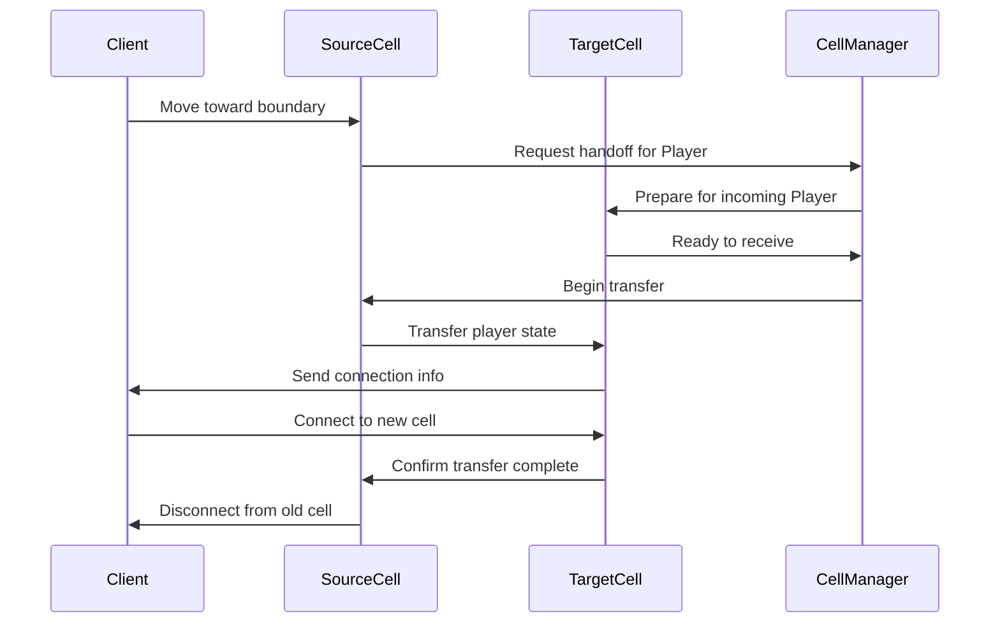

# Seamless World Streaming Architecture

## Single Shard Reality Check

**Key Insight:** True "everyone in one instance" is a multi-year engineering challenge. We achieve the **illusion** of a single global shard through seamless cell handoffs and unified services.

**Strategy:** EVE Online approach - single universe feeling with behind-the-scenes partitioning and load balancing.

---

## Spatial Partitioning Design

### Cell Grid Architecture

```
World Grid (128m × 128m cells):

     0   1   2   3   4   5
   ┌───┬───┬───┬───┬───┬───┐
 0 │A0 │A1 │A2 │A3 │A4 │A5 │  Each cell = 128m × 128m
   ├───┼───┼───┼───┼───┼───┤  Max players per cell = 25
 1 │B0 │B1 │B2 │B3 │B4 │B5 │  Interest radius = 192m
   ├───┼───┼───┼───┼───┼───┤  (covers 9 cells total)
 2 │C0 │C1 │C2 │C3 │C4 │C5 │
   └───┴───┴───┴───┴───┴───┘

Player in B2 interested in: A1,A2,A3,B1,B2,B3,C1,C2,C3
```

### Cell Ownership Model

**Server Assignment:**
- Each cell owned by exactly one game server instance
- Dynamic load balancing based on player density
- Hot cell migration when population exceeds capacity

```csharp
public class CellManager
{
    private Dictionary<CellId, ServerId> cellOwnership;
    private Dictionary<CellId, int> playerCounts;
    
    public void AssignCell(CellId cellId, ServerId serverId)
    {
        cellOwnership[cellId] = serverId;
        // Notify affected players of ownership change
        NotifyPlayersOfCellTransfer(cellId, serverId);
    }
    
    public bool ShouldMigrateCell(CellId cellId)
    {
        return playerCounts[cellId] > MAX_PLAYERS_PER_CELL;
    }
}
```

---

## Interest Management System

### Area of Interest (AOI) Calculation

**Player Subscription Model:**
- Primary Cell: Player's current cell (full updates)
- Adjacent Cells: 8 surrounding cells (reduced updates)
- Ghost Zones: Entities visible across cell boundaries

```
Interest Zones for Player in B2:

┌─────┬─────┬─────┐
│ A1  │ A2  │ A3  │  Ghost Zone (position only)
│     │     │     │  Update Rate: 5 Hz
├─────┼─────┼─────┤
│ B1  │[B2] │ B3  │  Primary Zone (full data)
│     │ P   │     │  Update Rate: 30 Hz  
├─────┼─────┼─────┤
│ C1  │ C2  │ C3  │  Adjacent Zone (gameplay data)
│     │     │     │  Update Rate: 15 Hz
└─────┴─────┴─────┘
```

### Interest Subscription System

```csharp
public class InterestManager
{
    public class Subscription
    {
        public PlayerId Player { get; set; }
        public CellId Cell { get; set; }
        public InterestLevel Level { get; set; } // Primary, Adjacent, Ghost
        public float LastUpdate { get; set; }
    }
    
    public void UpdatePlayerInterest(PlayerId playerId, Position newPosition)
    {
        var newCells = CalculateInterestedCells(newPosition);
        var oldSubscriptions = GetPlayerSubscriptions(playerId);
        
        // Add new subscriptions
        foreach (var cell in newCells.Except(oldSubscriptions.Select(s => s.Cell)))
        {
            Subscribe(playerId, cell, GetInterestLevel(newPosition, cell));
        }
        
        // Remove old subscriptions
        foreach (var sub in oldSubscriptions.Where(s => !newCells.Contains(s.Cell)))
        {
            Unsubscribe(playerId, sub.Cell);
        }
    }
}
```

---

## Seamless Handoff System

### Player Transfer Protocol

**Cross-Cell Movement:**
1. **Approach Boundary:** Client predicts movement, server validates
2. **Handoff Initiated:** Source cell notifies target cell of incoming player
3. **State Transfer:** Player data (position, inventory, buffs) sent to target
4. **Client Transition:** Client receives new server connection info
5. **Seamless Switch:** Client connects to new server without interruption



### Ghost Entity System

**Cross-Border Visibility:**
- Entities near cell boundaries visible in adjacent cells
- Ghost entities receive position updates only
- Full entity data when player enters same cell

```csharp
public class GhostEntity
{
    public EntityId Id { get; set; }
    public Position Position { get; set; }
    public string DisplayName { get; set; }
    public EntityType Type { get; set; }
    // Limited data for cross-cell visibility
    
    public void UpdateFromFullEntity(Entity fullEntity)
    {
        Position = fullEntity.Position;
        // Only sync essential visual data
    }
}
```

---

## Load Balancing & Migration

### Dynamic Cell Assignment

**Load Metrics:**
- Player count per cell
- CPU usage per server instance  
- Network bandwidth utilization
- AI entity count and complexity

**Migration Triggers:**
- Player count > 25 per cell
- Server CPU > 80% sustained
- Network latency > 150ms average
- Memory usage > 1.5GB per server

### Live Migration Process

```csharp
public class CellMigrator
{
    public async Task MigrateCell(CellId cellId, ServerId targetServer)
    {
        // 1. Freeze cell state
        await FreezeCell(cellId);
        
        // 2. Serialize all entities
        var cellState = await SerializeCellState(cellId);
        
        // 3. Transfer to new server
        await TransferCellState(cellState, targetServer);
        
        // 4. Update routing table
        await UpdateCellOwnership(cellId, targetServer);
        
        // 5. Notify all interested players
        await NotifyPlayersOfMigration(cellId, targetServer);
        
        // 6. Resume operations
        await UnfreezeCell(cellId);
    }
}
```

### Backpressure & Capacity Management

**Cell Population Limits:**
- Soft Cap: 20 players (ideal performance)
- Hard Cap: 25 players (maintain quality)
- Emergency: Queue system for popular areas

**Time Dilation Strategy:**
```csharp
public class CellTickManager
{
    public void UpdateTickRate(CellId cellId)
    {
        var load = CalculateCellLoad(cellId);
        
        if (load > 0.9f)
        {
            // Reduce tick rate to maintain quality
            SetTickRate(cellId, 20); // Down from 30Hz
        }
        else if (load < 0.6f)
        {
            // Increase tick rate when resources available
            SetTickRate(cellId, 30); // Back to full rate
        }
    }
}
```

---

## Global Services Architecture

### Decoupled Service Layer

```
┌─────────────────────────────────────────┐
│              Global Layer               │
├─────────────┬─────────────┬─────────────┤
│    Chat     │   Economy   │    Auth     │
│   Service   │   Service   │   Service   │
└─────────────┴─────────────┴─────────────┘
       │             │             │
┌──────┼─────────────┼─────────────┼──────┐
│      │      Cell Simulation Layer      │
├──────▼──┬─────▼────┬─────▼────┬──▼─────┤
│ Cell A1 │ Cell A2  │ Cell A3  │ Cell A4│
│Server 1 │ Server 1 │ Server 2 │ Server 2│
└─────────┴──────────┴──────────┴────────┘
```

**Service Responsibilities:**

**Chat Service:**
- Global channels (World, Trade, Guild)
- Cross-cell whispers and party chat
- Message persistence and history

**Economy Service:**
- Auction house spanning all cells
- Market price discovery
- Trade transaction validation

**Authentication Service:**
- Player login and session management
- Character data synchronization
- Anti-cheat coordination

```csharp
public class GlobalChatService
{
    public async Task SendGlobalMessage(PlayerId sender, string message, ChatChannel channel)
    {
        // Validate message (rate limiting, content filter)
        if (!ValidateMessage(sender, message)) return;
        
        // Determine recipients based on channel
        var recipients = await GetChannelRecipients(channel);
        
        // Send to all relevant cell servers
        var cellServers = GetCellServersForPlayers(recipients);
        await Task.WhenAll(cellServers.Select(server => 
            server.DeliverChatMessage(sender, message, channel, recipients)));
    }
}
```

---

## Failure Recovery & Resilience

### Cell Crash Recovery

**Automatic Recovery:**
1. **Detection:** Health checks detect unresponsive cell server
2. **Player Evacuation:** Move players to adjacent cells temporarily
3. **State Recovery:** Restore cell state from last checkpoint
4. **Service Restoration:** Restart cell server and reload state
5. **Player Return:** Migrate players back to recovered cell

**State Persistence:**
- Cell checkpoints every 60 seconds
- Player state persisted on cross-cell movement
- Transaction logs for recent changes

### Partial Outage Handling

**Graceful Degradation:**
- Close cell borders to prevent entry
- Allow current players to continue in working cells
- Disable global services temporarily if needed
- Display maintenance message for affected areas

```csharp
public class DisasterRecovery
{
    public async Task HandleCellServerCrash(ServerId crashedServer)
    {
        var affectedCells = GetCellsOnServer(crashedServer);
        
        foreach (var cellId in affectedCells)
        {
            // Evacuate players to safe zones
            await EvacuatePlayersFromCell(cellId);
            
            // Mark cell as offline
            await MarkCellOffline(cellId);
            
            // Initiate recovery process
            await StartCellRecovery(cellId);
        }
    }
}
```

---

## Phased Roadmap

### Phase 0: Single Cell (Current MVP)
- **Scope:** 512m × 512m area, 20 players
- **Features:** Basic gameplay, no streaming
- **Timeline:** 2 weeks
- **Success Criteria:** Stable multiplayer experience

### Phase 1: Multi-Cell Foundation
- **Scope:** 4 connected cells (1km × 1km total)
- **Features:** Seamless movement between cells
- **Timeline:** 4 weeks after Phase 0
- **Success Criteria:** No interruption during cell transitions

**Technical Milestones:**
- [ ] Cell boundary detection and handoff protocol
- [ ] Ghost entity system for cross-cell visibility
- [ ] Basic load balancing between 2 servers
- [ ] Global chat service spanning all cells

### Phase 2: Regional Cell Mesh
- **Scope:** 16-25 cells (2km × 2km), 100+ concurrent players
- **Features:** Dynamic load balancing, live migration
- **Timeline:** 8 weeks after Phase 1
- **Success Criteria:** Auto-scaling based on player density

**Technical Milestones:**
- [ ] Dynamic cell migration during high load
- [ ] Interest management optimization
- [ ] Global services (economy, auction house)
- [ ] Monitoring and alerting systems

### Phase 3: Global Routing Layer
- **Scope:** Unlimited world size, 1000+ CCU target
- **Features:** Multi-region support, advanced analytics
- **Timeline:** 12 weeks after Phase 2
- **Success Criteria:** Support for multiple geographical regions

**Technical Milestones:**
- [ ] Global player directory and routing
- [ ] Cross-region cell communication
- [ ] Advanced metrics and business intelligence
- [ ] Production-ready monitoring and ops tools

---

## Performance Targets by Phase

| Phase | Cells | Players | Latency | Server Count | Complexity |
|-------|-------|---------|---------|--------------|------------|
| 0     | 1     | 20      | <100ms  | 1            | Simple     |
| 1     | 4     | 50      | <120ms  | 2            | Medium     |
| 2     | 25    | 200     | <150ms  | 5-10         | High       |
| 3     | ∞     | 1000+   | <200ms  | Auto-scale   | Expert     |

---

## Success Metrics

### Technical Metrics
- **Handoff Success Rate:** >99.5% seamless transfers
- **Ghost Entity Accuracy:** Position sync within 100ms
- **Load Balance Efficiency:** No cell >80% capacity sustained
- **Recovery Time:** <60 seconds for cell crash recovery

### Player Experience Metrics
- **Perceived Latency:** <150ms for cross-cell actions
- **World Cohesion:** Global chat delivery <500ms
- **Exploration Flow:** No visible "loading" during movement
- **Population Distribution:** No empty cells with queued popular areas

---

**Next Document:** Versioned data schemas and validation system.
